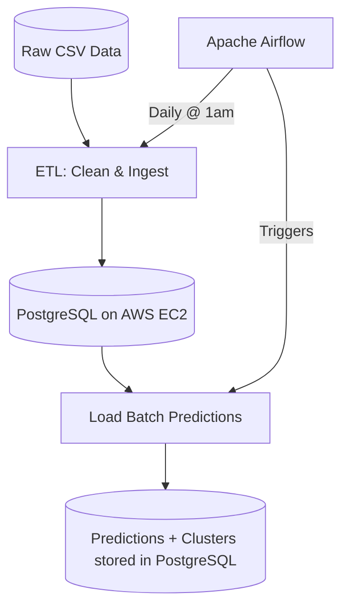

# Home Credit Default Risk Analysis & ML Pipeline

In consumer lending, accurately identifying high-risk applicants reduces default losses while avoiding unfair rejection of creditworthy borrowers. This project builds a production-ready credit risk scoring system using the Home Credit dataset (300k+ applicants), comparing interpretable models required by financial regulators with ensemble methods optimized for predictive accuracy. It demonstrates a complete data science lifecycle, featuring a comparative study between a baseline pipeline and an advanced feature-engineered pipeline

* **Competition:** [Home Credit Default Risk](https://www.kaggle.com/c/home-credit-default-risk)
* **Dataset:** [Kaggle Data Link](https://www.kaggle.com/c/home-credit-default-risk/data)
---

## Architecture


---
## Engineering Highlights

- **Automated Workflow:** Orchestrated end-to-end data pipeline with Apache Airflow, scheduling daily ETL and batch scoring on AWS EC2.
- **Containerized Infrastructure:** Deployed PostgreSQL and pipeline execution environment using Docker and Docker Compose, ensuring environment consistency.
- **Model Stability Monitoring:** Implemented PSI (Population Stability Index) to detect data drift; Random Forest achieved near-zero drift (PSI = 0.0005) across 187 features.
- **Batch Inference Architecture:** Serialized trained models via joblib following a cost-efficient batch processing pattern suitable for financial scoring use cases where real-time inference is not required.
---


## Tech Stack & Infrastructure

- **Cloud:** AWS EC2 (Ubuntu)
- **Database:** PostgreSQL 15 (Docker)
- **Orchestration:** Apache Airflow 2.8.1 (Docker Compose)
- **Containerization:** Docker
- **Pipeline:** Python, pandas, scikit-learn, SQLAlchemy

---

## Project Structure
```
├── notebook/
│   ├── credit_risk_analysis.ipynb   # EDA, feature engineering, model training
│   └── model_output.ipynb           # Model export for deployment
├── pipeline/
│   ├── 01_clean.py                  # ETL: data cleaning and ingestion
│   ├── 02_load_predictions.py       # Load batch predictions to PostgreSQL
│   ├── Dockerfile                   # Container for pipeline execution
│   └── requirements.txt
├── dags/
│   └── credit_pipeline.py           # Airflow DAG for daily scheduling
└── README.md
```

---
## Modeling Framework: Pipeline A vs. Pipeline B

The project is structured into two distinct pipelines to evaluate the impact of feature engineering and dimensionality:

### **Pipeline A: Traditional Credit Scoring (Baseline)**
* **Feature Set:** Focused on core applicant data (e.g., Income, Loan Amount, Age).
* **Preprocessing:** Implemented **WoE (Weight of Evidence) Binning** to transform raw variables into monotonic risk indicators.
* **Feature Selection:** Utilized **IV (Information Value)** to filter out weak predictors (maintaining variables with IV > 0.1).
* **Model:** Standard **Logistic Regression** to establish a baseline for credit scoring and probability of default (PD).
* **Robustness Metrics:** * **KS Statistic:** Measured the model's ability to separate good and bad applicants.
    * **PSI (Population Stability Index):** Monitored distribution shifts between train and test sets to ensure model stability.
  
### **Pipeline B: Advanced Integrated Pipeline (187 Features)**
* **Feature Set:** Expanded to **187 features** by integrating external sources (`EXT_SOURCE_1/2/3`), credit bureau history, and previous loan applications.
* **Key Enhancements:**
    * **Supervised Learning:** Implemented **Random Forest** as the primary ensemble model to capture complex non-linear relationships and compute **Feature Importance**.
    * **Strategic Feature Selection:** Isolated the **Top 15 most influential features** (e.g., external scores, age, and credit amount) to create a high-signal subspace for robust modeling.
    * **Unsupervised Segmentation:** Performed **K-Means Clustering ($K=5$)** on this optimized feature-selected data to identify distinct **Risk Personas**.
    * **Risk Validation:** Cross-referenced clusters with actual **Default Rates**, successfully isolating a high-risk group (**Cluster 4**) with a **13.8% default rate**.
---

## Final Cluster Risk Profile (Pipeline B)

| Cluster | Default Rate | Avg RF Probability | Population Size | Risk Category |
| :--- | :--- | :--- | :--- | :--- |
| **3** | **13.77%** | **55.29%** | 71,903 | 🔥 **High Risk** |
| **2** | 6.04% | 39.85% | 46,372 | Moderate |
| **4** | 5.85% | 39.63% | 68,235 | Moderate |
| **0** | 5.67% | 38.12% | 38,647 | Low-Moderate |
| **1** | **4.69%** | **36.33%** | 20,851 | ✅ **Low Risk** |

---


##  Model Performance Comparison

| Model | Pipeline | ROC-AUC | KS Statistic | F1-Score | Stability (PSI) |
| :--- | :--- | :---: | :---: | :---: | :---: |
| **Random Forest** | **B** | **0.7342** | **0.3485** | **0.2589** | **0.0005** |
| **Logistic Regression** | **A** | 0.7309 | 0.3406 | 0.2463 | 0.0001 |
| **Decision Tree** | **B** | 0.7170 | 0.3252 | 0.2415 | 0.0002 |

### **Key Observations:**
1.  **High-Fidelity Discrimination:** Pipeline B's **Random Forest** is the champion model, providing the best balance of precision and recall for minority class (defaulter) detection.
2.  **Exceptional Stability:** All models maintained a **PSI < 0.001**, indicating that the feature engineering process is highly resilient to data drift between training and testing.
3.  **The "Double-Lock" Mechanism:** By cross-referencing RF probabilities with **Cluster 3** membership, the bank can identify high-risk "outliers" that might otherwise bypass traditional linear scoring models.

--- 


## Production Pipeline

Models are trained on Kaggle and serialized via joblib. The production server handles daily ETL and batch inference, following a cost-efficient batch processing architecture suitable for credit scoring use cases where real-time inference is not required.
